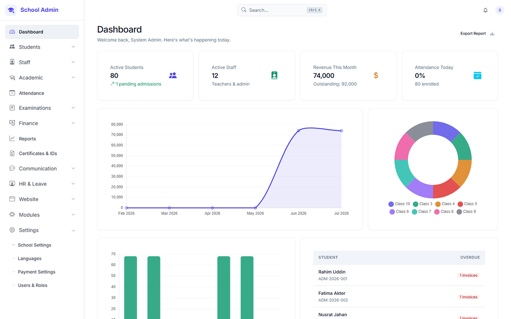

# School Management System v2

[](https://github.com/tanzibhossain/school-management-backend/actions/workflows/tests.yml)
[](https://github.com/tanzibhossain/school-management-backend/actions/workflows/pint.yml)
[](https://github.com/tanzibhossain/school-management-backend/actions/workflows/phpstan.yml)
[](phpstan.neon)
[](LICENSE)


[](#-contributing)


A **single-school, self-hosted** school management platform built with **Laravel 13**, **PHP 8.3**, **MySQL 8**, and **Redis 7**. Designed for a school to manage academics, students, staff, finances, and communications — all from a modern server-rendered **Laravel Blade + Bootstrap 5** admin interface.

Every deployment serves exactly one school — no multi-tenant SaaS layer, no separate frontend to stand up. Clone it, point it at your own database, and it's yours to run and modify.



---

## ✨ Key Features

| Category | Modules |
|----------|---------|
| **Core Platform** | School (single-school), Academic (years, classes, sections, subjects, routines), User/Auth (Sanctum + Spatie) |
| **Student Lifecycle** | Student (enrollment, promotion, transfer, TC), Online Admission, Data Import |
| **Academics** | Examination (types, exams, seating), Mark (grades, GPA, tabulation), Certificate (admit cards, testimonials, TC), Attendance (student + staff, RFID, auto clock-out) |
| **Finance** | FeeItem (categories, items, discounts), Payment (invoices, bKash/SSLCommerz/Stripe/PayPal, cheques, refunds, credits), Payroll (salary components, runs, loan integration), Report (fee collection, dues, ledger) |
| **Communication** | Announcement, SMS (batches, GSM-7/Unicode segments, billing), Messaging (threads, 1:1 + group, role-restricted, attachments) |
| **Operations** | Staff (departments, designations, loans), Leave (student + staff, approval workflow), Library (books, borrow/return, overdue), Transport (routes, vehicles, driver swap, SMS alerts), ID Card (batches, PDF generation, Horizon jobs), LMS (courses, lessons, assignments, AI check), Website (CMS, block-based homepage, drag-drop menus) |
| **Localization** | Language (DB-backed translations, RTL support, scan + editor UI) |

---

## 👥 User Roles

| Role | Description | Portal Access |
|------|-------------|---------------|
| **Super Admin** | School owner / top admin — full access to everything | Admin panel (all modules) |
| **Admin** | School-level administrator — full school access | Admin panel (all modules) |
| **Teacher** | Own classes — marks, attendance | Staff portal |
| **Accountant** | Finance — payments, waivers, payroll, salary certificates | Admin panel (finance modules) |
| **Librarian** | Library module only | Admin panel (library) |
| **Receptionist** | Front desk — announcements, admissions, inquiries | Admin panel (limited) |
| **Student** | Own records — results, attendance, fees, timetable | Student portal |
| **Parent** | Child's records — results, attendance, fees | Parent portal |

> Roles are limited to: `super_admin`, `admin`, `teacher`, `accountant`, `librarian`, `receptionist`, `student`, `parent`. The `super_admin` role maps to the "Super Admin" row above.

> **Auth:** Laravel Sanctum (API tokens) + Spatie Laravel Permission (roles/permissions).  
> **Session auth** for Blade admin UI (`web` guard). **Token auth** for mobile/API (`sanctum` guard + `ability` middleware).

---

## 🏗 Architecture & Project Structure

```
school-management-backend/
├── app/
│   ├── Modules/                # 26 domain modules (see table above)
│   │   └── {Module}/
│   │       ├── Http/
│   │       │   ├── Controllers/  # Thin controllers (max 40 lines/method)
│   │       │   ├── Requests/     # FormRequests for every write endpoint
│   │       │   └── Resources/    # JsonResources — never return raw models
│   │       ├── Models/           # Eloquent models with scopes, relationships
│   │       ├── Repositories/     # Cache-aside pattern (Cache::tags)
│   │       ├── Services/         # Business logic, DB transactions
│   │       ├── Observers/        # Cache tag flushing on saved/deleted
│   │       ├── database/migrations/
│   │       └── routes/
│   ├── Services/                # Shared services (PDF rendering, etc.)
│   ├── Repositories/             # BaseRepository, CacheRepository
│   └── Providers/
├── docs/modules/                 # Per-module specification docs
├── resources/views/              # Blade admin UI (Bootstrap 5, DataTables 2)
│   ├── layouts/admin.blade.php
│   └── admin/                    # Module-specific views
├── routes/
│   ├── web.php                   # Admin UI routes (auth + school middleware)
│   └── api.php                   # API routes (sanctum + ability middleware)
├── database/
│   ├── seeders/                  # Module seeders (roles, permissions, grading, menus, languages)
│   └── migrations/               # Shared migrations
├── tests/Feature/                 # 206+ feature tests (mirrors modules)
└── docker-compose.yml             # Full stack: app, nginx, db, redis, minio, horizon, scheduler
```

**Key Patterns:**
- **10-step module pattern**: Migration → Model → Repository → Service → Observer → Requests → Resources → Controller/Routes → Tests → Pint/DocBlocks
- **Repository pattern** with Redis tag-based caching (`Cache::tags(['student'])->flush()` in observers)
- **Financial writes** wrapped in `DB::transaction()` — never cached
- **All queries scoped to `school_id`** via `app('current_school_id')` (set by `SetCurrentSchoolFromSession` middleware)
- **Sanctum abilities** for API; **Spatie roles** for admin UI authorization

---

## 🐳 Quick Start (Docker)

### Prerequisites
- Docker Desktop (or Docker Engine + Compose)
- Git

### 1. Clone & Configure

```bash
git clone https://github.com/tanzibhossain/school-management-backend.git
cd school-management-backend
cp .env.example .env
```

### 2. Start Containers

Builds and starts everything (3–5 min on the first run), then check that all services are healthy:

```bash
docker compose up -d --build
docker compose ps
```

Expected services: `app`, `nginx`, `db` (MySQL 8), `redis`, `minio`, `horizon`, `scheduler`

### 3. Initialize Application

Generates the app key, runs migrations, and links storage:

```bash
docker compose exec app php artisan key:generate
docker compose exec app php artisan migrate --seed
docker compose exec app php artisan storage:link
```

> **Note:** The `--seed` flag runs all module seeders (roles, permissions, grading templates, gateways, menus, languages, etc.)

### 4. Verify

| Service | URL | Credentials |
|---------|-----|-------------|
| **Admin Portal** | http://localhost:8080/admin/login | `admin@school.edu.bd` / `Admin@1234` |
| **Staff & Teachers Portal** | http://localhost:8080/staff/login | `teacher@school.edu.bd` / `Teacher@1234` |
| **Student & Guardian Portal** | http://localhost:8080/login | `student@school.edu.bd` / `Student@1234` · Guardian: `parent@school.edu.bd` / `Parent@1234` |
| **API Health Check** | http://localhost:8080/api/v2/health | — |
| **MinIO Console** | http://localhost:9001 | `minioadmin` / `minioadmin` |
| **Horizon** | http://localhost:8080/horizon | Admin only |
| **MySQL** | localhost:3306 | `school_user` / `school_pass` (from `.env`) |

> **Port Note:** Uses **8080** (not 8000) — Windows Hyper-V reserves 7980–8079.

---

## 🔌 API Documentation

Generate interactive docs with [Scribe](https://scribe.knuckles.wtf/):

```bash
docker compose exec app php artisan scribe:generate
```

Open: http://localhost:8080/docs

Postman collection auto-exported to `public/docs/collection.json`.

---

## 🌍 Multi-Country / Global Ready

- **Locale per school**: currency, timezone, locale, academic year pattern, weekend days
- **Payment gateways by country**: BD → bKash + SSLCommerz; others → Stripe + PayPal
- **Grading templates**: BD National 5.0, US Letter 4.0, UK 9-1, Percentage-only — editable per class
- **Result strategies**: BD National, Simple Average, Weighted Average, Percentage-only
- **Addresses**: Free-form (no hardcoded geo tables)
- **Institution code**: Generic label, configurable per school

---

## 🛠 Common Commands

**Daily workflow** (start, stop, check status, follow logs)
```bash
docker compose up -d
docker compose down
docker compose ps
docker compose logs -f app
```

**Laravel commands** (run inside the container — `queue:work` is optional, Horizon already processes the queue)
```bash
docker compose exec app php artisan migrate
docker compose exec app php artisan migrate:fresh --seed
docker compose exec app php artisan queue:work
docker compose exec app php artisan schedule:run
docker compose exec app php artisan test
```

**Code style**
```bash
docker compose exec app ./vendor/bin/pint
docker compose exec app php artisan ide-helper:generate
```

---

## 🤝 Contributing

Contributions are welcome — bug fixes, new modules, translations, docs.

1. Fork the repository
2. Create a feature branch off `dev`: `git checkout -b feature/amazing-feature`
3. Follow the **10-step module pattern** (Migration → Model → Repository →
   Service → Observer → Requests → Resources → Controller/Routes → Tests →
   Pint/DocBlocks), one commit per step — see `CLAUDE.md` for the full
   convention and commit message format
4. Run the test suite: `docker compose exec app php artisan test`
5. Run Pint: `docker compose exec app ./vendor/bin/pint`
6. Run Larastan: `docker compose exec app ./vendor/bin/phpstan analyse`
7. Submit a PR to `dev`

Every PR runs the [Tests](.github/workflows/tests.yml), [Code Style](.github/workflows/pint.yml),
and [Static Analysis](.github/workflows/phpstan.yml) workflows automatically — the badges at
the top of this file reflect the current state of `dev`.

### Code Standards
- PHP 8.3, Laravel 13, strict types
- PSR-12 + Laravel Pint (run before commit)
- [Larastan](https://github.com/larastan/larastan) (PHPStan for Laravel) at level 5, raised over time
- Every write endpoint: FormRequest + JsonResource
- Controllers ≤ 40 lines/method — logic in Services
- Repository pattern for reads (cached), Services for writes (transactional)

---

## 📄 License

GNU Affero General Public License v3.0 (AGPL-3.0) — see [LICENSE](LICENSE) for details.

The AGPL's network-use clause means that if you run a modified version of
this software as a network service (e.g. a hosted SaaS offering), you must
make the modified source available to that service's users.

---

## 🙏 Acknowledgments

- [Laravel](https://laravel.com) — The PHP framework for web artisans
- [Spatie Laravel Permission](https://spatie.be/docs/laravel-permission) — Role/permission management
- [Laravel Sanctum](https://laravel.com/docs/sanctum) — API token authentication
- [Bootstrap 5](https://getbootstrap.com) — Admin UI framework
- [DataTables 2](https://datatables.net) — Admin tables
- [DomPDF](https://github.com/dompdf/dompdf) — PDF generation
- [MinIO](https://min.io) — Self-hosted S3-compatible storage
- [Laravel Horizon](https://laravel.com/docs/horizon) — Queue monitoring
- [Scribe](https://scribe.knuckles.wtf) — API documentation

---

## 📞 Support

- **Issues**: [GitHub Issues](https://github.com/tanzibhossain/school-management-backend/issues)
- **Discussions**: [GitHub Discussions](https://github.com/tanzibhossain/school-management-backend/discussions)

---

> **Built for schools, by developers who understand school operations.**  
> Self-hosted. Single-school. Globally adaptable. Open source.
